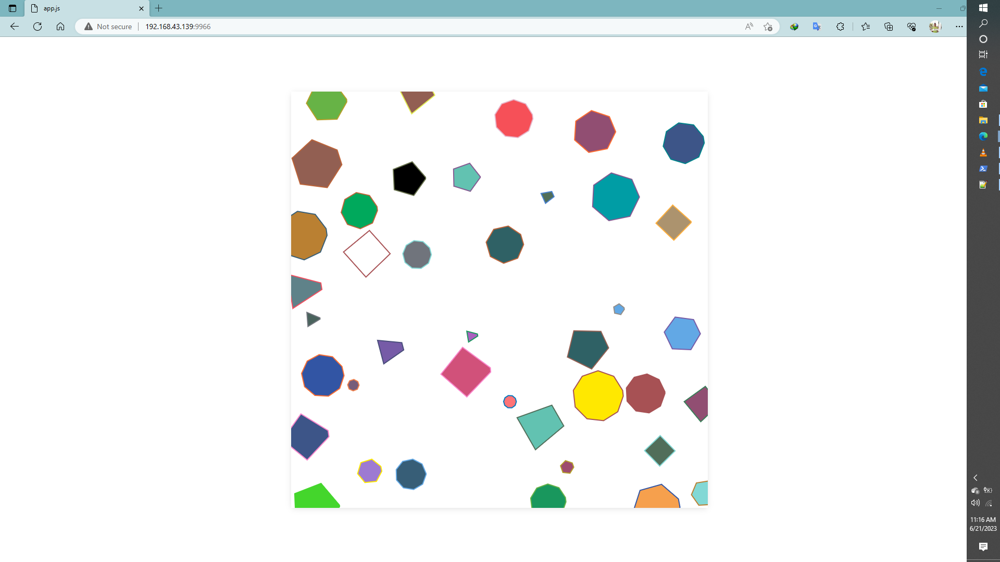

<p align="center">
    <a href="https://www.linkedin.com/in/zo-ambinintsoa">
        
    </a>
    <a href="mailto:ambinintsoa.business@gmail.com">
        
    </a>
</p>

# Spinning Shapes



<br/>

This is a JavaScript project that generates spinning shapes on a canvas using the `canvas-sketch` library. The shapes are randomly placed on the canvas and can be clicked to trigger spinning animation.


## Installation

To run this project, you need to have Node.js installed on your system. Follow these steps to get started:

1. Clone the project repository or download the source code.

2. Open a terminal and navigate to the project directory.

3. Install the required dependencies by running the following command:

   ```shell
   npm install
    ```
# Spinning Shapes

This is a JavaScript project that generates spinning shapes on a canvas using the `canvas-sketch` library. The shapes are randomly placed on the canvas and can be clicked to trigger spinning animation.

## Installation

To run this project, you need to have Node.js installed on your system. Follow these steps to get started:

1. Clone the project repository or download the source code.

2. Open a terminal and navigate to the project directory.

3. Install the required dependencies by running the following command:

   ```shell
   npm install
    ```
## Usage
Once the dependencies are installed, you can run the project with the following command:

## shell

 Copy code : 

```shell 
    npm start
```

This will start the application and open a new browser window displaying the spinning shapes on a canvas. You can click on any shape to trigger the spinning animation.

## Customization
The project provides several options for customization. You can modify the following variables in the sketch function to change the behavior of the spinning shapes:

``shapeCount:`` The number of shapes generated on the canvas.
<br/>

``shapeMinSides and shapeMaxSides:`` The minimum and maximum number of sides for the shapes.

``shapeMinSize and shapeMaxSize:`` The minimum and maximum size (diameter) of the shapes.

``stopSpinningTime:`` The duration (in milliseconds) after which the spinning animation stops for a shape.


``rotationSpeed: ``The initial rotation speed of the shapes.
Feel free to adjust these variables to create different visual effects.

## Dependencies

This project relies on the following external libraries:

``canvas-sketch: `` A framework for creating generative art with the HTML5 canvas.

``canvas-sketch-util/random:`` A utility library for generating random numbers and values.

``riso-colors:`` A collection of colors inspired by Risograph printing.
poisson-disk-sampling: A library for generating evenly spaced points on a 2D surface.

These dependencies are automatically installed when you run npm install.

## License
This project is licensed under the MIT License. You can find the license information in the LICENSE file.

## Credits
The project was created by Zo ambinintsoa and is based on the canvas-sketch library developed by Matt DesLauriers.

<p align="center">
    <a href="https://www.linkedin.com/in/zo-ambinintsoa">
        
    </a>
    <a href="mailto:ambinintsoa.business@gmail.com">
        
    </a>
</p>